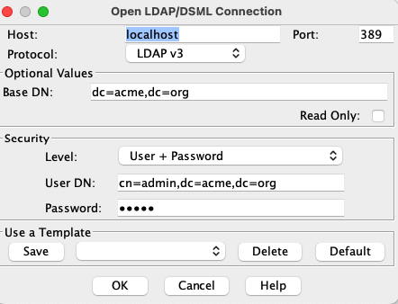

# Docker Library

<p align="center">
  
  <p align="center">Welcome to my Docker Library, a storage place for my assets related to my journey around Containers' Land</p>
</p>

---

  [](https://github.com/zricethezav/gitleaks#pre-commit) [](https://github.com/awslabs/git-secrets) [](https://github.com/anchore/scan-action) [](https://github.com/carlosrodlop/docker-lib/actions/workflows/mdLinkChecker.yml)

Welcome to the Docker Library, my storage for reusable assets related to container engines.

- Since Docker runtime was deprecated in Kubernetes version 1.20 ([Kubernetes is deprecating Docker as a container runtime after v1.20.](https://kubernetes.io/blog/2020/12/02/dont-panic-kubernetes-and-docker/)), I made the `Makefile` to be compatible also with [containerd/nerdctl](https://github.com/containerd/nerdctl) container engine. (See [How To Replace Docker With nerdctl And Rancher Desktop - DevOps ToolKit](https://www.youtube.com/watch?v=evWPib0iNgY))
- Docker images are uploaded to the following registries via GitHub Actions:
  - [Github](https://github.com/carlosrodlop?tab=packages&repo_name=docker-labs)
  - [DockerHub](https://hub.docker.com/u/carlosrodlop)
- Copy the `.env.example` file to `.env` and edit the variables to your needs.
- To pass additional Environment Variables during the execution of the container use `.docker/docker.env` file.

## Image Catalog

### ASDF + ohmyz.sh

[](https://github.com/carlosrodlop/docker-labsactions/workflows/ci_asdf.alpine.ub.yaml) [](https://github.com/carlosrodlop/docker-labs/actions/workflows/ci_asdf.ubuntu.ub.yaml)

Image for my demos with nice [Oh My Zsh](https://ohmyz.sh/) and tool installation via [asdf](https://asdf-vm.com/)

### Stress and Stress-ng

[](https://github.com/carlosrodlop/docker-labs/actions/workflows/ci_stress.ubuntu.ub.yaml)

Image for Load Testing including [stress](https://linux.die.net/man/1/stress) and [stress-ng](https://manpages.ubuntu.com/manpages/bionic/man1/stress-ng.1.html)

### Osixia openldap + Data

[](https://github.com/carlosrodlop/docker-labs/actions/workflows/ci_ooldap.debian.ub.yaml)

Image for Ldap mock testing extending from [osixia/docker-openldap](https://github.com/osixia/docker-openldap). Ref [Build an OpenLDAP Docker Image That’s Populated With Users](https://betterprogramming.pub/ldap-docker-image-with-populated-users-3a5b4d090aa4)

Configuration examples:

* [JXExplorer](http://jxplorer.org/): Use for troubleshooting purposes. For Kubernetes use [[port-fowarding](https://www.weave.works/blog/kubectl-port-forward)



* Jenkins ([JCasC](https://www.jenkins.io/projects/jcasc/)). It assumes `ldap-service` as the name of the service and `kube-system` as the namespace.

```yaml
jenkins:
  securityRealm:
    ldap:
      configurations:
      - managerDN: "cn=admin,dc=acme,dc=org"
        managerPasswordSecret: "admin"
        rootDN: "dc=acme,dc=org"
        server: "ldap-service.kube-system.svc.cluster.local"
        userSearch: "cn={0}"
```

#### Alternative: Load Data via ldapadd

* Do not copy data into `/container/service/slapd/assets/config/bootstrap/ldif`
* Add the users/groups with the following command:

```sh
ldapadd -h localhost -p 389 -c -x -D cn=admin,dc=acme,dc=org -W -f data.v3.ldif
```